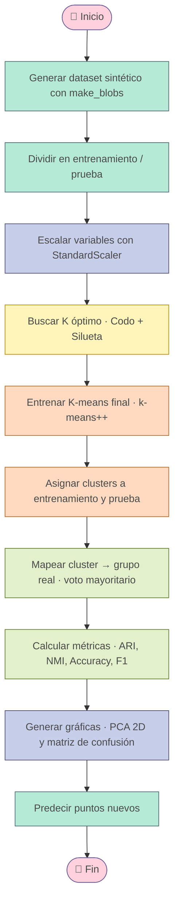

<div align="center">

# 🌸 Algoritmo K-means con scikit-learn 🌸

### *Uso de framework o biblioteca de aprendizaje máquina para la implementación de k-means*


*Tecnológico de Monterrey · Módulo 2 — Inteligencia Artificial Avanzada para la Ciencia de Datos*

</div>

---

## 📋 Tabla de contenido

- [📌 Descripción general](#-descripción-general)
- [🧠 ¿Qué es K-means?](#-qué-es-k-means)
- [🗂️ Estructura del repositorio](#️-estructura-del-repositorio)
- [⚙️ Instalación](#️-instalación)
- [▶️ Ejecución](#️-ejecución)
- [🔧 Parámetros disponibles](#-parámetros-disponibles)
- [🔄 Flujo del algoritmo](#-flujo-del-algoritmo)
- [📊 Dataset](#-dataset)
- [📈 Resultados obtenidos](#-resultados-obtenidos)
- [🖼️ Gráficas generadas](#️-gráficas-generadas)
- [🧾 Conclusiones](#-conclusiones)
- [📚 Referencias](#-referencias)
- [👩‍💻 Autora](#-autora)

---

## 📌 Descripción general


Este repositorio contiene la implementación completa del algoritmo **K-means** utilizando la biblioteca **scikit-learn**, aplicada sobre un **dataset sintético tipo *blobs*** generado con `make_blobs`. El proyecto incluye:

- 🧩 El **script en Python** (`kmeans.py`) totalmente parametrizable desde consola.
- 📄 El **reporte académico en PDF** (`Algoritmo_K-means_.pdf`) con la justificación teórica, metodología y análisis de resultados.

El objetivo es demostrar el uso de un algoritmo de **aprendizaje no supervisado** para agrupar datos, y **validar objetivamente** su desempeño comparándolo contra una verdad base conocida (posible gracias al uso de datos sintéticos).

---

## 🧠 ¿Qué es K-means?

> K-means es un algoritmo de clustering **particional y basado en centroides**. Cada cluster se representa mediante un centroide, y cada instancia se asigna al centroide más cercano (usualmente con distancia euclidiana). El algoritmo itera entre **asignación** de puntos y **actualización** de centroides hasta converger.

<div align="center">

| 🌷 Concepto | 💬 Descripción |
|:---|:---|
| **Distancia Euclidiana** | Métrica estándar para medir cercanía entre puntos y centroides |
| **Inercia (WCSS)** | Suma de distancias al cuadrado de cada punto a su centroide; K-means la minimiza |
| **Método del codo** | Heurística visual para elegir K observando dónde se estabiliza la inercia |
| **Coeficiente de silueta** | Mide qué tan bien separado y compacto está cada cluster (rango -1 a 1) |
| **ARI / NMI** | Métricas que comparan los clusters contra los grupos reales, penalizando el azar |

</div>

---

## 🗂️ Estructura del repositorio

```text
📦 kmeans-proyecto/
 ┣ 📜 kmeans.py                     # Script principal (ejecutable desde consola)
 ┣ 📄 Algoritmo_K-means_.pdf        # Reporte académico completo
 ┣ 📁 salida/                       # Carpeta generada automáticamente al ejecutar
 ┃ ┣ 🖼️ 01_metodo_codo.png
 ┃ ┣ 🖼️ 02_silueta.png
 ┃ ┣ 🖼️ 03_clusters_entrenamiento.png
 ┃ ┣ 🖼️ 04_clusters_prueba.png
 ┃ ┣ 🖼️ 05_matriz_confusion.png
 ┃ ┣ 🖼️ 06_curva_convergencia.png
 ┃ ┣ 📄 clusters_entrenamiento.csv
 ┃ ┣ 📄 clusters_prueba.csv
 ┃ ┗ 📄 resultados.txt
 ┗ 📖 README.md
```

---

## ⚙️ Instalación

<details>
<summary>💻 Ver dependencias necesarias</summary>

<br>

Instala las librerías requeridas con `pip`:

```bash
pip install numpy pandas matplotlib seaborn scikit-learn
```

</details>

| 📦 Librería | 🎯 Uso en el proyecto |
|:---|:---|
| `scikit-learn` | `make_blobs`, `train_test_split`, `StandardScaler`, `KMeans`, `PCA`, métricas |
| `pandas` | Manejo de datos en `DataFrame` / `Series` |
| `numpy` | Operaciones numéricas y manejo de arreglos |
| `matplotlib` | Gráficas del codo, silueta, PCA y convergencia |
| `seaborn` | Mapa de calor de la matriz de confusión |
| `argparse` | Parámetros configurables desde consola |

---

## ▶️ Ejecución

Ejecución básica (valores por defecto):

```bash
python kmeans.py
```

Ejecución personalizada, por ejemplo con K=4, 1500 muestras, 6 variables y 4 grupos reales:

```bash
python kmeans.py --k 4 --n-mue 1500 --n-car 6 --n-grp 4
```

Ejecución con **K automático** (elegido según el coeficiente de silueta):

```bash
python kmeans.py --k 0
```

---

## 🔧 Parámetros disponibles

<div align="center">

| 🎛️ Parámetro | 🔢 Tipo | 🌼 Valor por defecto | 📝 Descripción |
|:---|:---:|:---:|:---|
| `--n-mue` | int | 1500 | Número de muestras a generar |
| `--n-car` | int | 6 | Número de variables (features) |
| `--n-grp` | int | 4 | Número de grupos reales a generar |
| `--disp` | float | 2.5 | Dispersión (`cluster_std`) de los grupos |
| `--k` | int | 4 | K fijo para el modelo final (usa `0` para K automático) |
| `--k-rango` | int int | 2 8 | Rango de K a evaluar en el método del codo/silueta |
| `--prueba` | float | 0.2 | Proporción del set de prueba |
| `--semilla` | int | 42 | Semilla aleatoria para reproducibilidad |
| `--dir-sal` | str | `salida` | Carpeta donde se guardan resultados y gráficas |

</div>

---

## 🔄 Flujo del algoritmo



---

## 📊 Dataset

Se utilizó un **dataset sintético** generado con `make_blobs`, lo que permite conocer de antemano la etiqueta real de cada instancia y así **evaluar objetivamente** qué tan bien K-means recupera esa estructura.

<div align="center">

| 🧮 Parámetro | Valor |
|:---|:---:|
| Muestras totales | 1500 |
| Variables numéricas | 6 (`Var_1` a `Var_6`) |
| Grupos reales | 4 (`Grupo_0` a `Grupo_3`) |
| Dispersión (`cluster_std`) | 2.5 |
| Semilla | 42 |

| ✂️ Partición | Muestras | Proporción |
|:---|:---:|:---:|
| Entrenamiento | 1200 | 80% |
| Prueba | 300 | 20% |

</div>

> 💡 Las variables se estandarizaron con `StandardScaler` (ajustado solo con entrenamiento) para que ninguna variable domine el cálculo de distancia euclidiana.

---

## 📈 Resultados obtenidos

El reporte compara el desempeño del modelo usando dos valores de K: el sugerido automáticamente por el coeficiente de silueta (**K=3**) y el número real de grupos del dataset (**K=4**).

<div align="center">

| 🌷 Métrica | K = 3 (silueta) | K = 4 (real) |
|:---|:---:|:---:|
| Inercia (WCSS) | 2486.275 | 1732.497 |
| Silhouette (entrenamiento) | 0.4522 | 0.4409 |
| Silhouette (prueba) | 0.4486 | 0.4458 |
| Adjusted Rand Index (ARI) | 0.7003 | **0.9911** |
| Normalized Mutual Info (NMI) | 0.8291 | **0.9872** |
| Accuracy (grupo mapeado) | 0.7467 | **0.9967** |
| F1-Score macro | 0.6624 | **0.9967** |

</div>

🌟 **Hallazgo clave:** aunque la silueta sugiere K=3, al forzar K=4 (el número real de grupos) el desempeño mejora sustancialmente en todas las métricas contra la verdad base — la matriz de confusión resulta casi perfectamente diagonal, con solo **1 error en 300 muestras de prueba**.

---

## 🖼️ Gráficas generadas

Al ejecutar el script, se generan automáticamente las siguientes visualizaciones dentro de `salida/`:

| Archivo | Contenido |
|:---|:---|
| `01_metodo_codo.png` | Curva de inercia (WCSS) vs. número de clusters K |
| `02_silueta.png` | Coeficiente de silueta vs. número de clusters K |
| `03_clusters_entrenamiento.png` | Proyección PCA 2D de los clusters (entrenamiento) |
| `04_clusters_prueba.png` | Proyección PCA 2D de los clusters (prueba) |
| `05_matriz_confusion.png` | Mapa de calor de la matriz de confusión (cluster ↔ grupo real) |
| `06_curva_convergencia.png` | Inercia por iteración, análoga a una curva de entrenamiento |

---

## 🧾 Conclusiones

- K-means demostró ser **simple, rápido y efectivo** para agrupar datos con forma esférica y clusters de tamaño similar.
- El **método del codo** y el **coeficiente de silueta** no siempre coinciden en el valor óptimo de K cuando existe traslape entre grupos — conviene interpretarlos en conjunto y con conocimiento del dominio.
- El modelo **generaliza bien**: las métricas de entrenamiento y prueba resultaron muy similares entre sí.
- La principal limitación práctica de K-means es la necesidad de **definir K de antemano**.

📄 Para el análisis completo, metodología, justificación matemática y figuras detalladas, consulta el reporte: **[`Algoritmo_K-means_.pdf`](./Algoritmo_K-means_.pdf)**

---

## 📚 Referencias

- Russell, S. & Norvig, P. (2010). *Artificial Intelligence: A Modern Approach* (3ra ed.). Prentice Hall.
- Mitchell, T. (1997). *Machine Learning*. McGraw-Hill.
- Pedregosa, F. et al. (2011). Scikit-learn: Machine Learning in Python. *Journal of Machine Learning Research*, 12, 2825-2830.
- [Documentación oficial de scikit-learn — Clustering](https://scikit-learn.org/stable/modules/clustering.html#k-means)
- Armijo, P. (2026). *Aprendizaje No Supervisado*. Tema 8, TC2034 — Tecnológico de Monterrey.

---

## 👩‍💻 Autora

<div align="center">

**Michelle Rergis Novelo** · A01798576
Tecnológico de Monterrey — TC3006C
Módulo 2: Inteligencia Artificial Avanzada para la Ciencia de Datos
Profesor: Jorge Adolfo Ramírez Uresti


</div>
